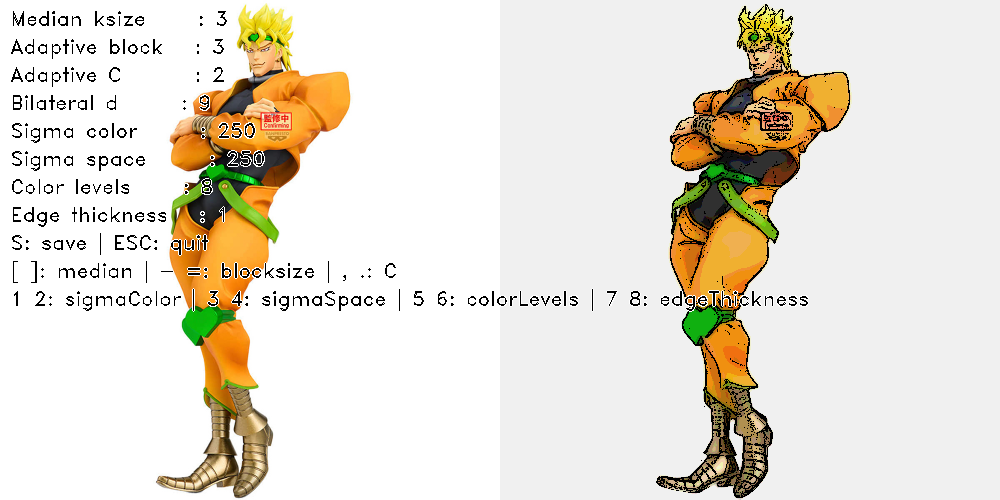
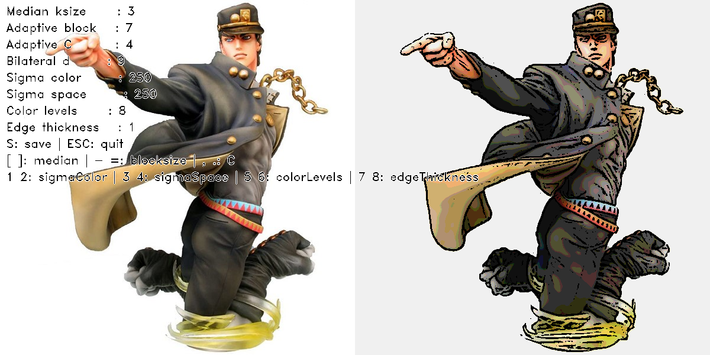
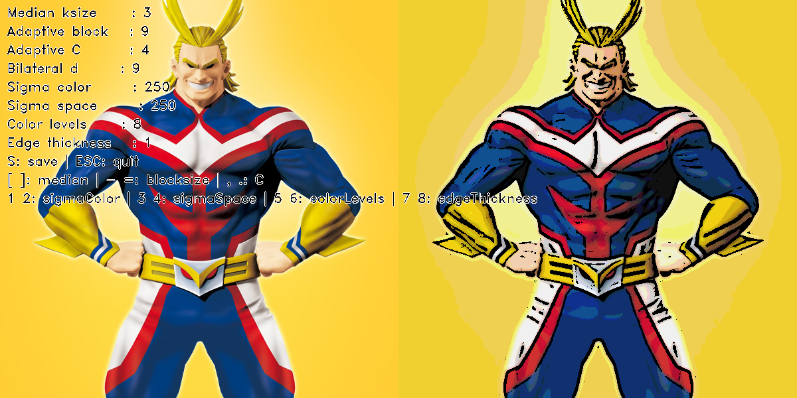
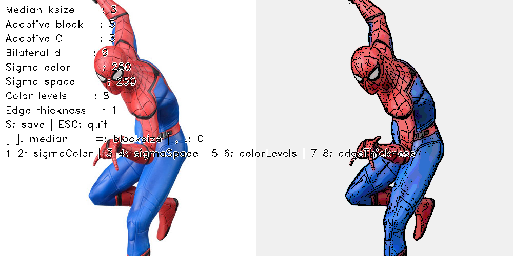

# Cartoon Rendering using OpenCV

OpenCV와 Python을 이용하여 입력 이미지를 만화(cartoon) 스타일로 변환하는 프로그램입니다.

---

## 📌 개요

본 프로젝트는 컴퓨터비전 수업 과제로, 이미지 처리 기법을 활용하여 일반 이미지를 만화 스타일로 변환하는 것을 목표로 합니다.

강의에서 배운 다양한 이미지 처리 기법을 조합하여 구현하였습니다.

---

## ⚙️ 사용 기술

- Python
- OpenCV
- NumPy

---

## 🧠 알고리즘 설명

본 프로그램은 다음과 같은 단계로 동작합니다:

1. **Grayscale 변환**
   - 컬러 이미지를 흑백 이미지로 변환

2. **Median Blur (노이즈 제거)**
   - 잡음을 제거하면서 경계를 보존

3. **Adaptive Thresholding (윤곽선 추출)**
   - 이미지의 윤곽선을 검출

4. **Bilateral Filter (색상 부드럽게 처리)**
   - 경계를 유지하면서 색상을 부드럽게 만듦

5. **Color Quantization (색상 단순화)**
   - 색상 수를 줄여 만화 느낌 강화

6. **이미지 결합**
   - 윤곽선 + 색상 이미지를 결합하여 최종 결과 생성

---

## 🖼️ 실행 방법

```bash
pip install opencv-python numpy
python main.py input.jpg

## 📷 데모 및 한계점 분석

### ✔ 만화 효과가 잘 표현되는 경우

#### 예시 1


#### 예시 2


#### 예시 3


위 이미지들은 만화 스타일이 비교적 잘 표현된 경우이다.

- 색 대비가 뚜렷하여 색상 단순화(color quantization)가 효과적으로 적용됨
- 객체의 윤곽선이 명확하여 edge detection 결과가 깔끔하게 나옴
- 배경이 비교적 단순하여 불필요한 edge가 적음
- 캐릭터 이미지 특성상 원래 색이 단순하고 명확하여 cartoon 효과와 잘 어울림

---

### ❌ 만화 효과가 잘 표현되지 않는 경우

#### 예시


위 이미지에서는 만화 효과가 상대적으로 덜 자연스럽게 나타난다.

- 옷의 주름이나 텍스처가 많아 edge가 과도하게 검출됨
- 색상이 부드럽게 변하는 영역에서 banding 현상이 발생
- 세밀한 디테일이 많아 noise처럼 보이는 edge가 생성됨
- 일부 영역에서 윤곽선이 과하게 강조되어 부자연스러운 결과가 나타남

---

## ⚠️ 한계점 (Limitations)

본 알고리즘은 전통적인 이미지 처리 기법을 기반으로 하기 때문에 다음과 같은 한계가 존재한다.

- **복잡한 배경에서 성능 저하**  
  배경이 복잡할 경우 불필요한 edge가 많이 생성되어 만화 느낌이 깨짐

- **텍스처가 많은 이미지에 취약**  
  머리카락, 옷 주름, 패턴 등이 많은 경우 edge가 과도하게 검출됨

- **색상 그라데이션 처리 한계**  
  색상 단순화 과정에서 banding 현상이 발생하여 자연스러움이 감소함

- **파라미터 의존성**  
  이미지마다 최적의 parameter가 달라 하나의 설정으로 모든 이미지에 좋은 결과를 얻기 어려움


---
